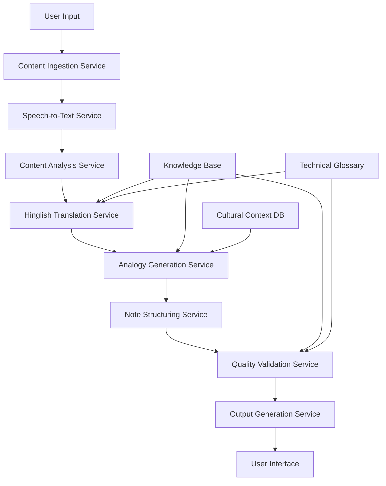

# Design Document: Vidya-Setu AI

## Overview

Vidya-Setu AI is a comprehensive educational assistance system that transforms complex English engineering lectures into simplified Hinglish notes enriched with local Indian analogies. The system employs a multi-stage processing pipeline that includes content ingestion, speech-to-text conversion, natural language processing for simplification, cultural analogy generation, and structured note creation.

The architecture follows a microservices approach with distinct components for each processing stage, enabling scalability and maintainability. The system leverages modern NLP techniques including large language models for translation and simplification, while incorporating domain-specific knowledge bases for technical accuracy and cultural context.

## Architecture

The system follows a pipeline architecture with the following high-level flow:



### Core Services

1. **API Gateway**: Routes requests and handles authentication
2. **Content Ingestion Service**: Processes various input formats
3. **Speech-to-Text Service**: Converts audio/video to text
4. **Content Analysis Service**: Extracts technical concepts and structure
5. **Hinglish Translation Service**: Simplifies and translates content
6. **Analogy Generation Service**: Creates culturally relevant analogies
7. **Note Structuring Service**: Organizes content into study-friendly format
8. **Quality Validation Service**: Ensures accuracy and appropriateness
9. **Output Generation Service**: Creates final formatted notes

### Data Storage

- **PostgreSQL**: User data, processing metadata, feedback
- **MongoDB**: Unstructured content, generated notes
- **Redis**: Caching, session management, job queues
- **S3-compatible storage**: File uploads, generated documents

## Components and Interfaces

### Content Ingestion Service

**Purpose**: Handle multiple input formats and prepare content for processing

**Interfaces**:
```typescript
interface ContentIngestionService {
  processTextContent(content: string): Promise<ProcessedContent>
  processAudioFile(file: AudioFile): Promise<ProcessedContent>
  processVideoFile(file: VideoFile): Promise<ProcessedContent>
  extractMetadata(file: File): Promise<ContentMetadata>
}

interface ProcessedContent {
  id: string
  type: 'text' | 'audio' | 'video'
  content: string
  metadata: ContentMetadata
  extractedText?: string
  technicalConcepts: string[]
}
```

**Key Features**:
- Support for PDF, DOCX, TXT, MP3, MP4, WAV formats
- Content validation and sanitization
- Metadata extraction (duration, file size, format)
- Technical concept identification using NER models

### Speech-to-Text Service

**Purpose**: Convert audio content to text with high accuracy

**Interfaces**:
```typescript
interface SpeechToTextService {
  transcribeAudio(audioFile: AudioFile): Promise<TranscriptionResult>
  transcribeWithTimestamps(audioFile: AudioFile): Promise<TimestampedTranscription>
  validateTranscriptionQuality(result: TranscriptionResult): Promise<QualityScore>
}

interface TranscriptionResult {
  text: string
  confidence: number
  language: string
  processingTime: number
}
```

**Implementation Details**:
- Primary: OpenAI Whisper API for high accuracy (target: >90% WER)
- Fallback: Google Speech-to-Text for redundancy
- Audio preprocessing: noise reduction, normalization
- Support for Indian English accents and mixed language content

### Hinglish Translation Service

**Purpose**: Convert complex English to simplified Hinglish

**Interfaces**:
```typescript
interface HinglishTranslationService {
  translateToHinglish(text: string, complexity: ComplexityLevel): Promise<TranslatedText>
  simplifyTechnicalTerms(text: string, domain: TechnicalDomain): Promise<SimplifiedText>
  validateTranslation(original: string, translated: string): Promise<ValidationResult>
}

interface TranslatedText {
  hinglishText: string
  simplificationLevel: number
  preservedTechnicalTerms: string[]
  readabilityScore: number
}
```

**Implementation Strategy**:
- Fine-tuned LLM (based on models like OpenHathi-7B or Gemma 2 9B)
- Technical glossary integration for domain-specific terms
- Readability assessment using adapted Flesch-Kincaid metrics for Hinglish
- Context-aware translation maintaining technical accuracy

### Analogy Generation Service

**Purpose**: Create culturally relevant analogies for technical concepts

**Interfaces**:
```typescript
interface AnalogyGenerationService {
  generateAnalogy(concept: TechnicalConcept, context: CulturalContext): Promise<Analogy>
  validateAnalogy(concept: TechnicalConcept, analogy: Analogy): Promise<ValidationScore>
  selectBestAnalogy(concept: TechnicalConcept, analogies: Analogy[]): Promise<Analogy>
}

interface Analogy {
  concept: string
  analogyText: string
  culturalContext: string
  accuracyScore: number
  relatabilityScore: number
  explanation: string
}
```

**Cultural Context Database**:
- Kitchen analogies (CPU as kitchen, RAM as counter space)
- Transportation (data flow as traffic, protocols as traffic rules)
- Family structures (parent-child relationships in programming)
- Sports (cricket for teamwork, strategy concepts)
- Festivals and traditions (synchronization, coordination)

### Note Structuring Service

**Purpose**: Organize content into study-friendly format

**Interfaces**:
```typescript
interface NoteStructuringService {
  structureContent(content: ProcessedContent): Promise<StructuredNotes>
  generateSummary(content: ProcessedContent): Promise<Summary>
  createPracticeQuestions(content: ProcessedContent): Promise<Question[]>
}

interface StructuredNotes {
  title: string
  sections: NoteSection[]
  keyPoints: string[]
  summary: string
  practiceQuestions: Question[]
  crossReferences: string[]
}
```

## Data Models

### Core Entities

```typescript
interface User {
  id: string
  name: string
  email: string
  academicYear: number
  preferredLanguage: 'hinglish' | 'hindi' | 'english'
  subjects: string[]
  createdAt: Date
}

interface LectureSession {
  id: string
  userId: string
  title: string
  subject: string
  inputType: 'text' | 'audio' | 'video'
  originalContent: string
  processedNotes: StructuredNotes
  processingStatus: 'pending' | 'processing' | 'completed' | 'failed'
  createdAt: Date
  completedAt?: Date
}

interface TechnicalConcept {
  id: string
  name: string
  domain: string
  definition: string
  hinglishTranslation: string
  analogies: Analogy[]
  difficulty: number
  prerequisites: string[]
}

interface ProcessingJob {
  id: string
  sessionId: string
  stage: ProcessingStage
  status: 'queued' | 'processing' | 'completed' | 'failed'
  progress: number
  estimatedCompletion: Date
  errorMessage?: string
}
```

### Knowledge Base Schema

```typescript
interface KnowledgeEntry {
  concept: string
  domain: TechnicalDomain
  englishDefinition: string
  hinglishExplanation: string
  analogies: CulturalAnalogy[]
  examples: string[]
  relatedConcepts: string[]
}

interface CulturalAnalogy {
  context: CulturalContext
  description: string
  explanation: string
  accuracy: number
  popularity: number
}
```

Now I need to use the prework tool to analyze the acceptance criteria before writing the Correctness Properties section.

## Correctness Properties

*A property is a characteristic or behavior that should hold true across all valid executions of a system—essentially, a formal statement about what the system should do. Properties serve as the bridge between human-readable specifications and machine-verifiable correctness guarantees.*

### Content Processing Properties

**Property 1: Technical concept extraction performance**
*For any* text-based lecture content under 50,000 words, processing and technical concept extraction should complete within 30 seconds while identifying at least 80% of domain-specific technical terms.
**Validates: Requirements 1.1**

**Property 2: Audio transcription accuracy**
*For any* audio lecture file with clear speech, the transcription should achieve at least 90% word accuracy as measured by Word Error Rate (WER).
**Validates: Requirements 1.2**

**Property 3: Video processing capability**
*For any* video lecture file, the system should successfully extract audio content and produce a transcription with equivalent accuracy to direct audio processing.
**Validates: Requirements 1.3**

**Property 4: Technical content identification**
*For any* lecture content containing mathematical equations, diagrams, or technical illustrations, the system should identify and flag at least 95% of such elements for special processing.
**Validates: Requirements 1.4**

**Property 5: Error handling for corrupted content**
*For any* corrupted or unreadable input file, the system should return a descriptive error message within 10 seconds without crashing or producing invalid output.
**Validates: Requirements 1.5**

### Translation and Simplification Properties

**Property 6: Technical term simplification**
*For any* technical content containing domain-specific jargon, the Hinglish converter should replace at least 80% of complex terms with simpler equivalents while maintaining semantic accuracy.
**Validates: Requirements 2.1**

**Property 7: Contextual explanation generation**
*For any* advanced terminology or jargon in the input, the system should generate contextual explanations in Hinglish that are comprehensible to first-year engineering students.
**Validates: Requirements 2.2**

**Property 8: Semantic accuracy preservation**
*For any* technical content, the simplified Hinglish version should maintain semantic similarity of at least 85% with the original content as measured by embedding-based similarity metrics.
**Validates: Requirements 2.3**

**Property 9: Structural coherence preservation**
*For any* lecture content with logical flow, the converted Hinglish version should preserve the same sequential structure and argument progression.
**Validates: Requirements 2.4**

**Property 10: Readability optimization**
*For any* generated Hinglish content, the readability score should fall within the range appropriate for first-year engineering students (equivalent to 8th-10th grade reading level).
**Validates: Requirements 2.5**

### Analogy Generation Properties

**Property 11: Analogy generation completeness**
*For any* technical concept identified in the content, the analogy engine should generate at least one culturally relevant Indian analogy with a relevance score above 0.7.
**Validates: Requirements 3.1**

**Property 12: Cultural context appropriateness**
*For any* generated analogy, the cultural context should be drawn from familiar Indian domains (kitchen, family, festivals, cricket, transportation) and be verifiable against the cultural context database.
**Validates: Requirements 3.2**

**Property 13: Cultural sensitivity validation**
*For any* generated analogy, the content should pass cultural sensitivity checks and not contain potentially offensive or inappropriate cultural references.
**Validates: Requirements 3.3**

**Property 14: Conceptual accuracy of analogies**
*For any* technical concept and its generated analogy, the key structural relationships and properties should be preserved with at least 80% conceptual mapping accuracy.
**Validates: Requirements 3.4**

**Property 15: Optimal analogy selection**
*For any* technical concept with multiple possible analogies, the system should select the analogy with the highest combined score for relatability and educational effectiveness.
**Validates: Requirements 3.5**

### Note Structure and Organization Properties

**Property 16: Hierarchical content organization**
*For any* processed lecture content, the generated notes should have a clear hierarchical structure with properly nested headings and subheadings that reflect the content organization.
**Validates: Requirements 4.1**

**Property 17: Section summary generation**
*For any* content section in the generated notes, there should be a key concept summary at the beginning that accurately captures the main points of that section.
**Validates: Requirements 4.2**

**Property 18: Seamless analogy integration**
*For any* generated analogy, it should be integrated into the explanatory text in a way that maintains natural flow and readability without disrupting the narrative structure.
**Validates: Requirements 4.3**

**Property 19: Important content highlighting**
*For any* generated notes, formulas, definitions, and key points should be properly marked with appropriate formatting that distinguishes them from regular text.
**Validates: Requirements 4.4**

**Property 20: Educational enhancement**
*For any* appropriate content section, the system should generate relevant practice questions or examples that reinforce the learning objectives.
**Validates: Requirements 4.5**

### Content Validation Properties

**Property 21: Technical correctness validation**
*For any* simplified explanation, the technical accuracy should be verified to ensure no fundamental concepts are misrepresented or lost during simplification.
**Validates: Requirements 5.1**

**Property 22: Analogy accuracy validation**
*For any* generated analogy, the conceptual mapping should be validated to ensure it accurately represents the essential characteristics of the technical concept.
**Validates: Requirements 5.2**

**Property 23: Misconception detection**
*For any* content that undergoes simplification, the system should identify and flag potential misconceptions or dangerous oversimplifications that could lead to incorrect understanding.
**Validates: Requirements 5.3**

**Property 24: Accuracy preservation fallback**
*For any* content where simplification would compromise technical accuracy, the system should preserve the original explanation and provide additional contextual support.
**Validates: Requirements 5.4**

**Property 25: Cultural appropriateness validation**
*For any* generated content including analogies and examples, the cultural sensitivity validator should ensure appropriateness according to established cultural guidelines.
**Validates: Requirements 5.5**

### User Interface Properties

**Property 26: Progress indication accuracy**
*For any* processing job in progress, the system should display progress indicators that are updated at least every 10 seconds and provide time estimates within 20% accuracy.
**Validates: Requirements 6.2**

**Property 27: Output formatting consistency**
*For any* completed processing job, the simplified notes should be displayed in a consistent, readable format with proper typography and spacing.
**Validates: Requirements 6.3**

**Property 28: Export functionality reliability**
*For any* generated notes, the system should provide functional download options for both PDF and text formats that produce valid, readable files.
**Validates: Requirements 6.4**

**Property 29: Feedback mechanism availability**
*For any* generated notes, the system should provide accessible feedback mechanisms that allow users to rate and comment on note quality.
**Validates: Requirements 6.5**

### Performance Properties

**Property 30: Text processing performance**
*For any* text content under 10,000 words, the complete processing pipeline should finish within 2 minutes under normal system load.
**Validates: Requirements 7.1**

**Property 31: Audio processing performance**
*For any* audio file under 1 hour duration, the complete processing including transcription and note generation should finish within 10 minutes.
**Validates: Requirements 7.2**

**Property 32: Concurrent processing capability**
*For any* set of concurrent requests up to the system's designed capacity, processing times should not degrade by more than 50% compared to single-request processing.
**Validates: Requirements 7.3**

**Property 33: Load management effectiveness**
*For any* system state with high load, requests should be properly queued with estimated wait times provided within 30 seconds of request submission.
**Validates: Requirements 7.4**

### Educational Effectiveness Properties

**Property 34: Progressive complexity structuring**
*For any* technical topic, the generated notes should demonstrate measurable complexity progression from basic analogies to technical details.
**Validates: Requirements 8.1**

**Property 35: Process decomposition clarity**
*For any* multi-step technical process, the explanation should be broken into sequential steps with clear transitions and dependencies.
**Validates: Requirements 8.2**

**Property 36: Real-world relevance connection**
*For any* technical concept, the notes should include contextual sections that connect the concept to practical applications and real-world relevance.
**Validates: Requirements 8.3**

**Property 37: Memory aid generation**
*For any* complex concept suitable for mnemonics, the system should generate appropriate memory aids in Hinglish that facilitate retention.
**Validates: Requirements 8.4**

**Property 38: Knowledge interconnection**
*For any* technical concept, the system should identify and suggest related concepts with appropriate cross-references to build comprehensive understanding.
**Validates: Requirements 8.5**

## Error Handling

The system implements comprehensive error handling across all components:

### Input Validation Errors
- **File Format Errors**: Unsupported file formats return specific error codes with suggested alternatives
- **File Size Errors**: Oversized files trigger graceful degradation with chunking options
- **Corruption Errors**: Corrupted files are detected early with detailed diagnostic information

### Processing Errors
- **Transcription Failures**: Audio processing errors trigger fallback to alternative STT services
- **Translation Errors**: NLP failures preserve original content with error annotations
- **Analogy Generation Failures**: Missing analogies trigger fallback to generic explanations

### System Errors
- **Resource Exhaustion**: Memory and CPU limits trigger job queuing with user notification
- **Service Unavailability**: Component failures trigger graceful degradation and user communication
- **Data Persistence Errors**: Database failures trigger retry mechanisms with user feedback

### Recovery Mechanisms
- **Automatic Retry**: Transient failures trigger exponential backoff retry logic
- **Graceful Degradation**: Partial failures allow completion with reduced functionality
- **User Notification**: All error states provide clear, actionable user feedback

## Testing Strategy

The testing approach combines unit testing for specific functionality with property-based testing for comprehensive validation of system behaviors.

### Unit Testing Focus
- **Component Integration**: Test interfaces between services
- **Edge Cases**: Handle boundary conditions and error scenarios  
- **Specific Examples**: Validate known input-output pairs
- **Cultural Content**: Test specific analogies and cultural references

### Property-Based Testing Configuration
- **Testing Framework**: Use Hypothesis (Python) or fast-check (TypeScript) for property-based tests
- **Test Iterations**: Minimum 100 iterations per property test to ensure statistical confidence
- **Input Generation**: Custom generators for technical content, audio samples, and cultural contexts
- **Property Validation**: Each property test references its corresponding design document property

### Test Data Strategy
- **Synthetic Content**: Generated technical lectures across engineering domains
- **Real Content**: Curated sample lectures from actual engineering courses
- **Cultural Validation**: Test analogies with diverse cultural reviewers
- **Performance Benchmarks**: Standardized content sets for performance validation

### Continuous Testing
- **Regression Testing**: Automated test suite runs on every code change
- **Performance Monitoring**: Continuous monitoring of processing times and accuracy metrics
- **User Feedback Integration**: Real user feedback incorporated into test case generation
- **Cultural Sensitivity Audits**: Regular review of generated content for cultural appropriateness